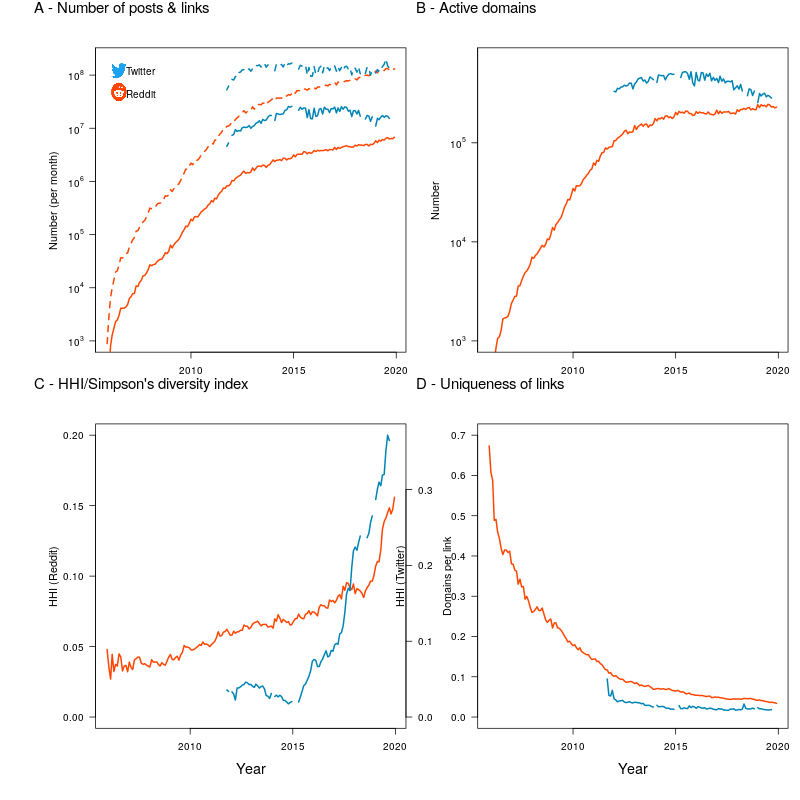

This repository contains code and data accompanying the publication "Evolution of diversity and dominance of companies in online activity" [[McCarthy et al, '20]]().

Reference:
===
```
[McCarthy et al, '20] McCarthy, P. X., Gong, X., Eghbal, S., Falster, D. S., & Rizoiu, M.-A. (2020). 
Evolution of diversity and dominance of companies in online activity.
```

Reproducing analysis and results:
===
All the data and code to reproduce the analysis, the results and the plots included in the main paper are found in this repository.
We use the `make` build system for running analysis and generating intermediary results, as well as plotting figures.
Usage examples:

* `make fig1` -- generates all the analysis required, and the figure `plots/Fig1.pdf`;
* `make clean` -- removes all generated files (`*.rds`, `*.dat`);
* `make all` -- reproduces all analysis and all plots. **WARNING**: this can take a while to execute, and might require a machine with significant memory.

Repository content:
===

This repository contains the following code scripts:  

* `scripts/process_compute-reddit-volume.R` and `process_compute-twitter-volume.R` -- R scripts that start the dataset files (`data/reddit.csv.xz`, `data/twitter.csv.1.xz` and `data/twitter.csv.2.xz`), and compute the number of posts, links, active domains, HHI and link uniqueness. Required for plotting `plots/Fig1.pdf`;
* `scripts/process_diversity-decrease.R` -- R scripts that start the dataset files and computes the diversity reduction indicators: skewness, kurtosis and PL fits. Required for plotting `plots/Fig1.pdf` and plotting `plots/Fig3.pdf` (**Note:** running this script requires significant memory);
* `scripts/process_twelve-functions-competitors.R` -- 
* `scripts/process_temporal-analysis.R` -- 
* `scripts/plot_fig1.R`, `scripts/plot_fig3.R`, `scripts/plot_fig5.R`, `scripts/plot_fig6.R` -- R script to plot the different figures in the paper;
* `scripts/utils.R` -- additional functions for reading, writing data and plotting.

The following data and plots is also available:

* `data/reddit.csv.xz` -- contains the monthly counts of links towards domains in Reddit (CSV compressed using LZMA). Lines are domain names, columns are months.
* `data/twitter.csv.1.xz` and `data/twitter.csv.2.xz` -- contain the monthly counts of links towards domains in Twitter (CSV compressed using LZMA). Lines are domain names, columns are months. The data frame has been split into two halves to respect GitHub's maximum file limits. The files need to be loaded individually, and concatenated at the level of rows. For example, in `R` do:
```{r, eval=FALSE}
# note: this might take some time to run, and require quite a bit of memory
dataset <- bind_rows(read_csv("data/twitter.csv.1.xz"),
                     read_csv("data/twitter.csv.2.xz") )
```

<!-- * `plots/vocation-map-static.pdf` -- a static version of the Vocation Map.  -->
<!-- * `plots/vocation-map-interactive.html` -- the interactive version of the Vocation Map. Also available at http://bit.ly/vocation-map-interactive . -->
<!-- * `plots/confusion-heatmap-dendogram.pdf` -- the confusion map for the XGBoost classifier (based on `data/prediction-results/*`) -->

Here is an example of the generated Figure 1 from the main text, obtained using `make fig1`:

<!--  -->

<!-- Additional data file: -->
<!-- === -->

<!-- The following files cannot be publicly shared due to the Twitter's and IBM Watson's Terms of Service. -->
<!-- However, these files could be provided privately upon request, requests are evaluated at a case-by-case basis. -->

<!-- * `data/all_users_data.csv.xz` -- contains the psychological profiles of all 128,278 users in our study; -->
<!-- * `data/10_professions_data.csv.xz` -- contains the Big5 and the personal values (10 features) for 38,073 users in the occupation prediction part of the paper; -->
<!-- * `data/10_professions_data_big5.csv.xz` -- contains solely the Big5 traits for the 38,073 users above (useful for the ablation study); -->
<!-- * `data/10_professions_data_values.csv.xz` -- contains solely the personal values for the 38,073 users above (useful for the ablation study). -->


License
===

Both data set and code are distributed under the General Public License v3 (GPLv3) license, a copy of which is included in this repository, in the LICENSE file. 
If you require a different license and for other questions, please contact us at Marian-Andrei@rizoiu.eu
